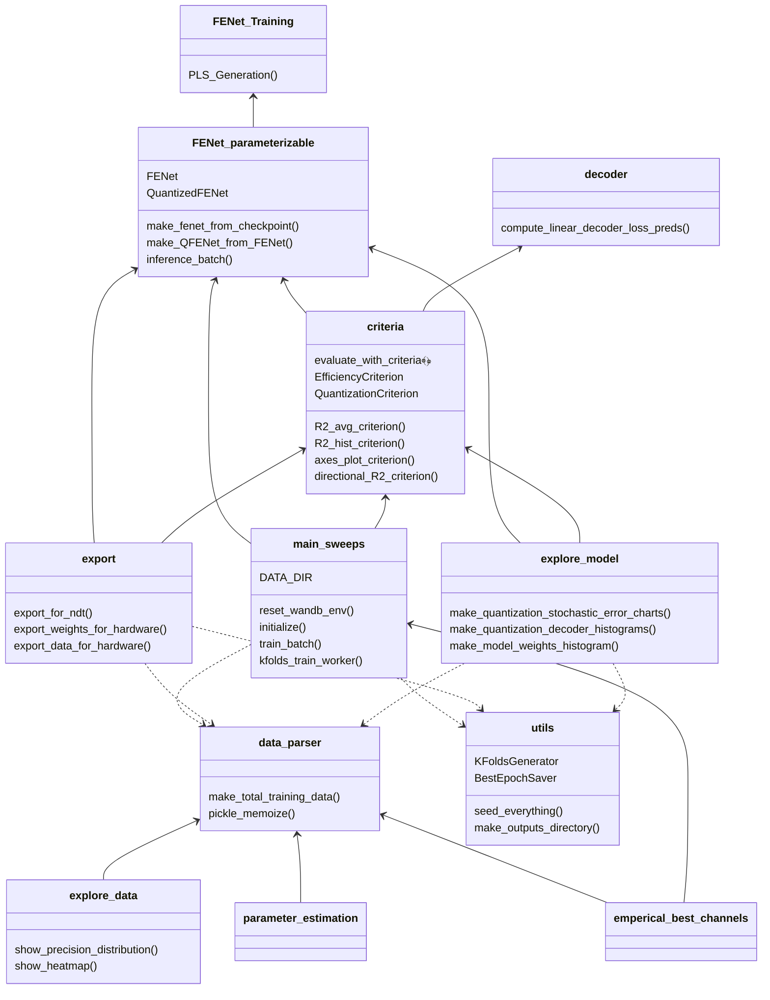

# FENet_Model

## TODO:
- [ ] export environment.yml
- [ ] update the File Structure mermaid diagram below
- [ ] remove dead code

## Getting Started
Set the following environment variables:
1. Set the default worker pool size with `FENET_MODEL_MAX_POOL_WORKERS`. `set FENET_MODEL_MAX_POOL_WORKERS=1` is a good default to disable multiprocessing. 
2. Set the `FENET_MODEL_DATA_DIR` to the directory with the `FennData_YYYYMMDD_Reshaped_30ms_cell_new.mat` files. 
3. Set the `FENET_MODEL_MODEL_SAVE_DIR`, the relative path to the directory where checkpoints are saved. Downstream experiments (eg. quantization sweeps, video generation) look for the BEST_MODEL in this directory.
4. There are additional configuration environment variables that can be left blank for training.
	1. Set the `FENET_MODEL_BEST_MODEL` to the **name** of the best model that will be used as the base for downstream exports (eg. hardware). Can be left blank for training.
4. Check what else you'd like to configure in `config.py`

TODO: activate the conda environment: 
```sh
conda env create -f environment.yml # creates a new environment on your machine called mics-fenet
conda env activate mics-fenet
```
Then, launch a run with `python3 main_sweeps.py`, installing Python packages as necessary.


## File Structure

This diagram details how the repository is layed out.


