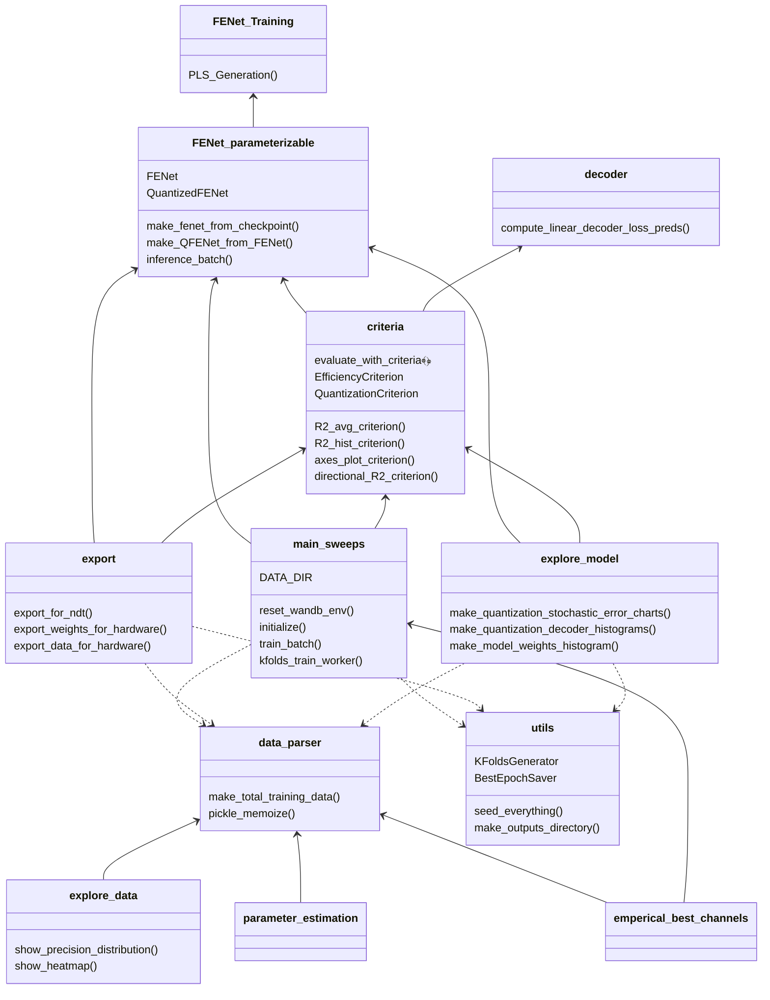

# FENet_Model

## Getting Started
Set the following environment variables:
**FENET_MODEL_DATA_DIR**
This indicates the directory where the training data is stored

**FENET_MODEL_MODEL_SAVE_DIR**
Directory where model checkpoints are saved

**FENET_MODEL_MAX_POOL_WORKERS**
Maximum number of thread workers available

Number of threads available for cpu to process. 
**FENET_MODEL_QUANTIZED_MODEL_DIR**
Directory of model that is quantized for hardware

**FENET_MODEL_QUANTIZED_DATA_DIR**
Directory of data that is quantized for hardware

**FENET_MODEL_BEST_MODEL**
Current best model file name

## File Structure

## Old Stuff

### File Structure
- `FENet.py` and `FENet_Training.py` are older files (before `dev-reparameterizable`)
    - `FENet.py` contains the original static implementation of FENet and is no longer used
    - `FENet_Training.py` contains data processing and visualization code that is depended on elsewhere, as well as an old training loop that isn't used
- `FENet_parameterizable.py` contains the `WaveletConvolution` `nn.Module` (a FENet convolutional layer) and the `FENet` class which reimplements the original FENet but parameterizable
- `data_parser.py` contains a number of functions to load numpy and HDF5 data and preprocesses it using some functions from `FENet_Training.py`
- `main_sweeps.py` will include [wandb](https://wandb.ai) integration and be the entry point for optimizing FENet

### Experiments (to create charts of)
- ~~decouple loss computation batch from FENet training batch, so that FENet can be trained on smaller batches / random batches but the loss computation is done on one days' worth of data (to give linear regression more data to work with)    - because training with smaller batches can lead to better results~~
    - depcerating this because larger LR often solves this, and we need to fit a decoder to compute loss which will overfit with small batches
- [x] quantization (it works!)
- [x] number of parameters
    - [x] number of layers, kernel size, stride, etc
- ~~performance by training time~~
    - I don't remember what this means
- [ ] ablation of modules (eg. data pre-normalization, label pre-normalization, PLS_Generation)
- [ ] loss function that punishes large weights
- [x] days of data used to train
- [ ] loss surface plot based on different archetictures? 
- [ ] stochastic weight averaging for better generalization? (https://arxiv.org/abs/1803.05407)
- [ ] currently: train FENet with PLSR dimensionality reduction (takes 8 features -> 2 features per channel). PLSR acts as normalization 
    - however, we could bring PLSR into FENet (simulate it using BatchNorm)

